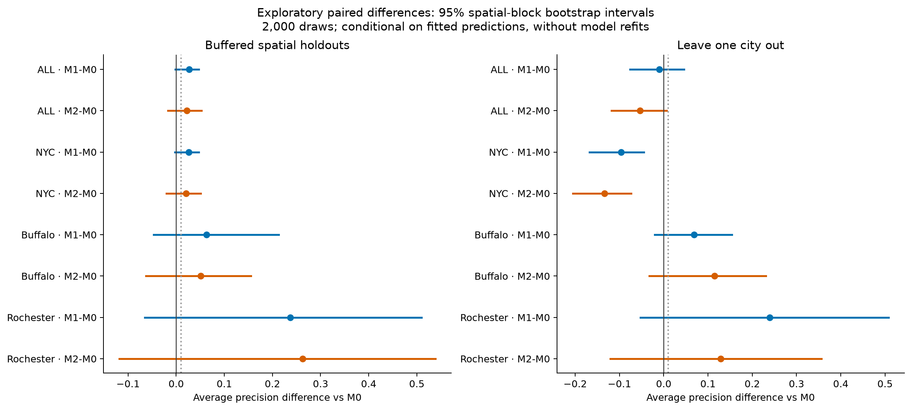

# Phase 4 exploratory results

The supported exploratory modeling workflow is complete and validated. **Full blueprint phase 4 is not complete:** the data contain only 2025 outcomes, so forward temporal validation cannot be performed, and earlier research-review gates remain open.

- [What was completed](docs/01_work_completed.md)
- [Methods](docs/02_methods.md)
- [Results and interpretation](docs/03_results.md)
- [Reproduction and files](docs/04_reproduce.md)

## Main result

| Evaluation | Model | AP / AUPRC | ROC-AUC | Brier | Top-decile precision | Top-decile lift |
| --- | --- | --- | --- | --- | --- | --- |
| Buffered spatial holdouts | M0 | 0.715 | 0.718 | 0.213 | 0.775 | 1.421 |
| Buffered spatial holdouts | M1 | 0.742 | 0.733 | 0.207 | 0.758 | 1.391 |
| Buffered spatial holdouts | M2 | 0.737 | 0.726 | 0.210 | 0.808 | 1.482 |
| Leave one city out | M0 | 0.643 | 0.685 | 0.319 | 0.592 | 1.085 |
| Leave one city out | M1 | 0.633 | 0.582 | 0.421 | 0.733 | 1.345 |
| Leave one city out | M2 | 0.589 | 0.525 | 0.305 | 0.642 | 1.177 |

No pooled model comparison met the working AP-gain criterion in either evaluation. None of the comparisons authorizes confirmatory claims or operational ATM risk scores.

The run covers 1,192 full-year sites, three model families, two evaluation schemes and six predefined analysis variants. It produced 141 outer-fold model artifacts across 47 evaluations. M0 uses lagged crime alone; M1 and M2 add the 13 phase 3 environmental predictors. All preprocessing and hyperparameter tuning occur within the training side of each split.

See the [paired AP comparisons](data/paired_ap_comparisons.csv), [all metrics](data/metrics.csv), [held-out predictions](data/predictions.csv), [validation](qa/validation.json) and [phase status](qa/phase4_status.json). Figures are saved as PNG and PDF in [figures](figures/).

