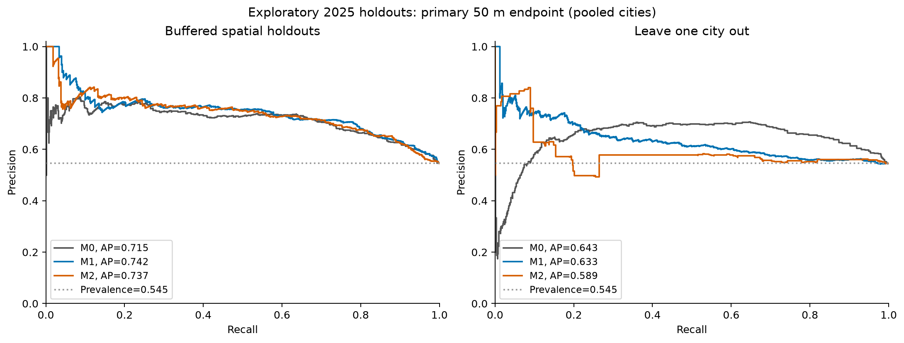
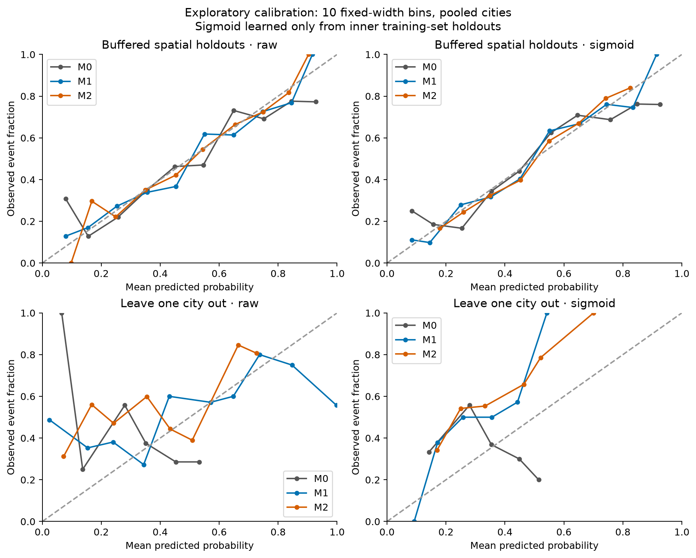

# Results and interpretation

The supported exploratory comparisons have finished and their saved artifacts passed validation. **This does not complete the blueprint's forward temporal or confirmatory evaluation.**

## Cohort

| City | Sites | Positive at 50 m | Prevalence |
| --- | --- | --- | --- |
| New York City | 1117 | 629 | 0.563 |
| Buffalo | 46 | 14 | 0.304 |
| Rochester | 29 | 7 | 0.241 |

## Primary 50 m results

| Evaluation | Model | AP / AUPRC | ROC-AUC | Brier | Top-decile precision | Top-decile lift |
| --- | --- | --- | --- | --- | --- | --- |
| Buffered spatial holdouts | M0 | 0.715 | 0.718 | 0.213 | 0.775 | 1.421 |
| Buffered spatial holdouts | M1 | 0.742 | 0.733 | 0.207 | 0.758 | 1.391 |
| Buffered spatial holdouts | M2 | 0.737 | 0.726 | 0.210 | 0.808 | 1.482 |
| Leave one city out | M0 | 0.643 | 0.685 | 0.319 | 0.592 | 1.085 |
| Leave one city out | M1 | 0.633 | 0.582 | 0.421 | 0.733 | 1.345 |
| Leave one city out | M2 | 0.589 | 0.525 | 0.305 | 0.642 | 1.177 |

Paired comparisons:

| Evaluation | Comparison | AP gain | 95% interval | Exploratory numerical gate |
| --- | --- | --- | --- | --- |
| Buffered spatial holdouts | M1-M0 | 0.027 | [-0.002, 0.047] | False |
| Buffered spatial holdouts | M2-M0 | 0.022 | [-0.017, 0.053] | False |
| Leave one city out | M1-M0 | -0.010 | [-0.076, 0.046] | False |
| Leave one city out | M2-M0 | -0.054 | [-0.118, 0.007] | False |

No pooled model comparison met the working AP-gain criterion in either evaluation. The numerical flag does not override unresolved phase 2/3 review or the missing future-year test. Report the observed estimates and uncertainty rather than selecting a more favorable radius, city or calibration variant.

Adding environmental predictors changed pooled spatial AP by +0.027 for logistic regression and +0.022 for XGBoost. Both spatial intervals include zero, so these point improvements do not establish reliable incremental value under the working criterion.

In leave-one-city-out evaluation, the pooled AP changes were -0.010 and -0.054, respectively. Pooled comparisons also rank predictions from different fitted models against each other, so probability comparability across cities affects the result. City-specific estimates are essential for interpretation. The saved comparisons show lower AP for both environmental models when NYC is held out; this result comes from training on only 75 Buffalo/Rochester sites and should not be generalized to all source/target designs.

The conclusion is inconclusive incremental value under the predefined pooled test, not proof that environmental context has no association with crime.

## City-specific results

| Evaluation | City | Model | AP | Brier |
| --- | --- | --- | --- | --- |
| Buffered spatial holdouts | New York City | M0 | 0.721 | 0.212 |
| Buffered spatial holdouts | New York City | M1 | 0.747 | 0.207 |
| Buffered spatial holdouts | New York City | M2 | 0.742 | 0.211 |
| Buffered spatial holdouts | Buffalo | M0 | 0.350 | 0.223 |
| Buffered spatial holdouts | Buffalo | M1 | 0.413 | 0.210 |
| Buffered spatial holdouts | Buffalo | M2 | 0.401 | 0.218 |
| Buffered spatial holdouts | Rochester | M0 | 0.227 | 0.227 |
| Buffered spatial holdouts | Rochester | M1 | 0.464 | 0.197 |
| Buffered spatial holdouts | Rochester | M2 | 0.490 | 0.161 |
| Leave one city out | New York City | M0 | 0.732 | 0.326 |
| Leave one city out | New York City | M1 | 0.637 | 0.436 |
| Leave one city out | New York City | M2 | 0.599 | 0.311 |
| Leave one city out | Buffalo | M0 | 0.331 | 0.219 |
| Leave one city out | Buffalo | M1 | 0.399 | 0.212 |
| Leave one city out | Buffalo | M2 | 0.446 | 0.207 |
| Leave one city out | Rochester | M0 | 0.222 | 0.226 |
| Leave one city out | Rochester | M1 | 0.462 | 0.189 |
| Leave one city out | Rochester | M2 | 0.351 | 0.204 |

Leave-one-city-out training sizes:

| Held-out city | Training sites | Training positives | Test sites |
| --- | --- | --- | --- |
| new_york_city | 75 | 21 | 1117 |
| buffalo | 1146 | 636 | 46 |
| rochester | 1163 | 643 | 29 |

The cities differ sharply in cohort size and prevalence. In particular, predicting NYC from the other two cities trains on only 75 sites, whereas predicting either smaller city trains largely on NYC. The small Buffalo/Rochester test samples produce unstable precision and top-decile estimates. Pooled metrics primarily reflect NYC and are not evidence of uniform cross-city benefit.

## Calibration

| Evaluation | Model | Raw Brier | Sigmoid Brier | Raw ECE | Sigmoid ECE |
| --- | --- | --- | --- | --- | --- |
| Buffered spatial holdouts | M0 | 0.213 | 0.215 | 0.052 | 0.053 |
| Buffered spatial holdouts | M1 | 0.207 | 0.207 | 0.047 | 0.042 |
| Buffered spatial holdouts | M2 | 0.210 | 0.211 | 0.024 | 0.032 |
| Leave one city out | M0 | 0.319 | 0.319 | 0.271 | 0.270 |
| Leave one city out | M1 | 0.421 | 0.266 | 0.409 | 0.142 |
| Leave one city out | M2 | 0.305 | 0.306 | 0.236 | 0.243 |

Lower Brier and ECE are better, but finite-bin ECE depends on the binning and sample size. Sigmoid calibration is a predefined secondary analysis and was learned without outer test labels. These results do not validate absolute risks for deployment.

## Sensitivity analyses

| Variant | Evaluation | M0 AP | M1 AP | M2 AP |
| --- | --- | --- | --- | --- |
| radius_25m | Buffered spatial holdouts | 0.526 | 0.529 | 0.473 |
| radius_25m | Leave one city out | 0.241 | 0.323 | 0.349 |
| radius_100m | Buffered spatial holdouts | 0.949 | 0.941 | 0.934 |
| radius_100m | Leave one city out | 0.947 | 0.914 | 0.911 |
| nearest_only_50m | Buffered spatial holdouts | 0.629 | 0.671 | 0.641 |
| nearest_only_50m | Leave one city out | 0.371 | 0.554 | 0.521 |
| report_cutoff_background | Buffered spatial holdouts | 0.715 | 0.742 | 0.735 |
| report_cutoff_background | Leave one city out | 0.645 | 0.633 | 0.590 |
| exclude_buffalo | Buffered spatial holdouts | 0.718 | 0.743 | 0.725 |
| exclude_buffalo | Leave one city out | 0.418 | 0.673 | 0.560 |

All sensitivities retain their original labels and model-selection procedure. They do not substitute for the primary result. The nearest-only definition changes incident attribution; excluding Buffalo changes both the training mixture and evaluation population. Neither comparison isolates a causal mechanism.

## Quality and execution

- Completed 47 outer evaluations and saved 141 fitted fold models.
- Verified 42636 held-out model prediction rows.
- Minimum verified inner/outer train–test center separation: 1522.93 m, above the 1,500 m requirement.
- Inner folds skipped for insufficient rows/classes: 3 logged fold instances.
- Model fits with fewer than two usable inner folds: 0; these use the predetermined first candidate and no sigmoid.
- Model-library warning records: 0. See the warning CSV; skipped-inner-fold notices are counted separately.
- Artifact validation: PASS (13 checks), including preprocessing reconciliation, exact prediction reproduction and paired-interval checks.

Execution started 2026-10-02T01:14:58.529265+00:00 and finished 2026-10-02T01:16:13.203669+00:00. Package versions and environment details are in `qa/run_environment.json`.

## What remains before a full phase 4 acceptance

1. Acquire additional exposure-supported annual cohorts, reconstruct their ex-ante features, and run the planned forward-time test.
2. Complete phase 2 independent crime/linkage/identity review and assess Buffalo's location precision.
3. Resolve or approve phase 3 feature definitions, spatial ambiguities and the missing-data treatment within the final modeling design.
4. Rebuild and rerun if those reviews change sites, labels, features or exposure eligibility.
5. Obtain researcher sign-off on the practical-effect criterion and evaluate calibration before any confirmatory or operational claim.

No causal feature explanation, optimized ATM placement or target-adaptation benefit is established here. The phase status remains **exploratory computational work complete; full blueprint phase 4 incomplete**.
